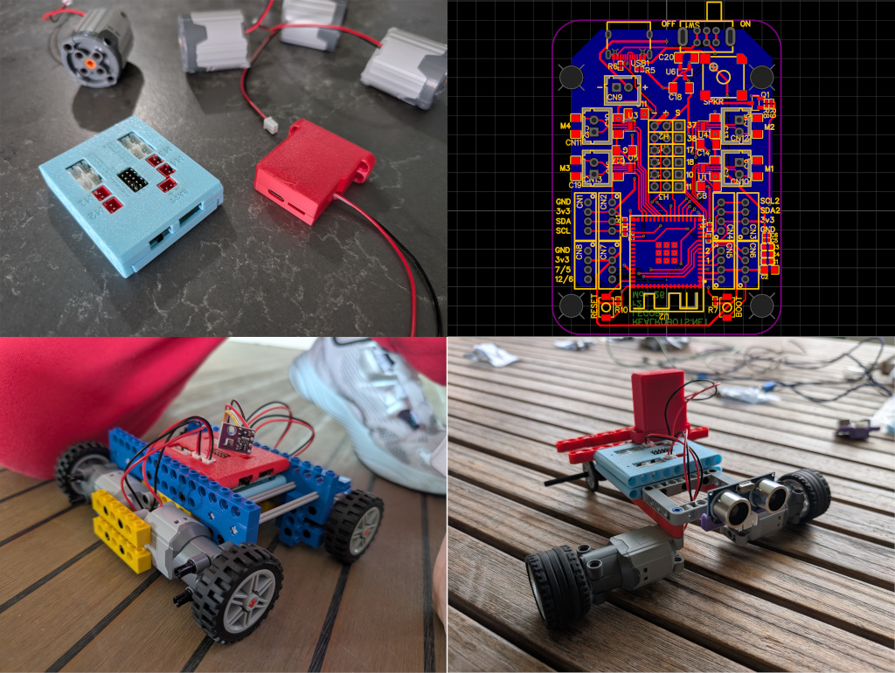

# Jake's Engineering Portfolio

Welcome to my engineering portfolio. This repository highlights selected projects that demonstrate my experience in software engineering, system design, and product execution.

## About Me

I build practical software with a focus on clean architecture, reliability, and developer experience.  
My interests include full-stack development, automation, and building tools that solve real user problems.

- **Location:** [Add your location]
- **Focus Areas:** [Example: Full-Stack, Backend, DevOps, AI Integrations]
- **Tech Stack:** [Example: TypeScript, React, Node.js, Python, SQL, AWS]
- **Contact:** [Add email or LinkedIn/GitHub link]

---

## Featured Projects

> Add one section per project.  
> Store project images in the `images/` folder and reference them with relative paths.

### 1) Lego Robot Components

A series of custom eleoctronics components and 3d printed housings designed to be compatible with lego Technic systems. Main component is an ESP32S2 main board with 4 motor drivers, speaker, and connections for 2 i2c channels, 5 servos, and other gpios broken out

---

### 2) Project Name

**What it is:**  
Short description of the project and the problem it solves.

**What I built:**  
- [Key feature 1]
- [Key feature 2]
- [Key feature 3]

**Tech used:**  
`[Framework]` `[`Language`]` `[`Database`]` `[`Cloud/Tooling`]`

**Impact / Results:**  
- [Example: Increased user retention]
- [Example: Automated a manual workflow]

**Links:**  
- Live Demo: [Add link]
- Source Code: [Add link]

---

### 3) Project Name

**What it is:**  
Short description of the project and the problem it solves.

**What I built:**  
- [Key feature 1]
- [Key feature 2]
- [Key feature 3]

**Tech used:**  
`[Framework]` `[`Language`]` `[`Database`]` `[`Cloud/Tooling`]`

**Impact / Results:**  
- [Example: Lowered cloud costs]
- [Example: Improved code quality and test coverage]

**Links:**  
- Live Demo: [Add link]
- Source Code: [Add link]

---

## Additional Projects

If you have more projects, list them briefly here:

- **Project Name** - One-line description. [Repo](#)
- **Project Name** - One-line description. [Repo](#)
- **Project Name** - One-line description. [Repo](#)

---

## Skills Snapshot

- **Languages:** [JavaScript/TypeScript, Python, ...]
- **Frontend:** [React, Next.js, Tailwind, ...]
- **Backend:** [Node.js, Express, FastAPI, ...]
- **Data:** [PostgreSQL, MongoDB, Redis, ...]
- **Cloud/DevOps:** [Docker, GitHub Actions, AWS, ...]
- **Testing:** [Jest, Playwright, Pytest, ...]

---

## How to Use This Portfolio

This repository is organized for easy review:

- `README.md` - Portfolio overview and featured work
- `images/` - Screenshots and visuals for each project

For best presentation:

1. Keep image names simple (e.g., `project-1.png`, `analytics-dashboard.jpg`)
2. Prefer landscape screenshots for consistency
3. Compress large images to keep repository size manageable

---

## Resume

You can add your resume file to this repository and link it here:

- [Download Resume](./resume.pdf)

---

## Let's Connect

- GitHub: [Add profile link]
- LinkedIn: [Add profile link]
- Email: [Add email]
